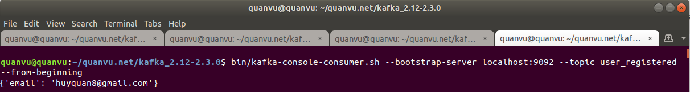

# Microservices with FastAPI - User Service

TODO

1. [x] Simple service structure
2. [x] CRUD for User Service with MySQL
3. [x] Integrate Pub/Sub messaging with Apache Kafka
3. [x] Config Docker for user_service
4. [ ] Config Docker for user_service_db
5. [ ] Use Cassandra database

## Project structure

## Quickstart

Setup environment

```shell
# create virtualenv ith python 3.7
virtualenv -p python3.7 venv-py3.7
source venv-py3.7/bin/activate
pip install -r requirements.in

# Run Database Migrations
alembic upgrade head

# Run FasiAPI app on special port 
cd app
uvicorn main:app --reload --port 8004
```

#### Test it

**Get list users**

```shell
curl --location --request GET 'http://127.0.0.1:8004/users/'
```

**Create a new user**

```shell
curl --location --request POST 'http://127.0.0.1:8004/users/' \
--header 'Content-Type: application/json' \
--data-raw '{
    "email" : "info@quanvu.net",
    "password": "QuanVu123",
    "is_active": true
}'
```

#### Swagger & ReDocs

Swagger 

- http://127.0.0.1:8004/docs

Redoc

- http://127.0.0.1:8004/redoc


## Kafka integration with Microservices

Now, we have a simple User Service using FastAPI. We will start Kafka on localhost and handle when a user register in our system. We will subscribe the user_registered topic and send email to user in another service like email_service.

#### User register business flow:

1. User input email/ password.
2. Create a new user in database.
3. Post user's data to Kafka Topic: user_registered (Producer).
4. Email service (Consumer) listen on user_registered and send an email to user (we will do this on Email Service later).

#### Start Apache Kafka local

Quick start a simple Apache Kafka on localhost

```
# Go to kafka installation directory
$ cd ~/kafka_2.12-2.3.0

# Kafka uses ZooKeeper so you need to first start a ZooKeeper server (on a new terminal)
$ bin/zookeeper-server-start.sh config/zookeeper.properties

# Now start the Kafka server (on a new terminal)
$ bin/zookeeper-server-start.sh config/zookeeper.properties

# Create user_registered topic 
$ bin/kafka-topics.sh --create --bootstrap-server localhost:9092 --replication-factor 1 --partitions 1 --topic user_registered

# Check list of topic
$ bin/kafka-topics.sh --list --bootstrap-server localhost:9092

# Start a Consumer
$ bin/kafka-console-consumer.sh --bootstrap-server localhost:9092 --topic user_registered --from-beginning

# Finish
```

Now, you complete start Apache Kafka on your localhost.

More about [quickstart Apache Kafka here](https://kafka.apache.org/quickstart)

#### Test User Registered event

Next, we open API at: http://localhost:8000/docs#/default/create_user_users__post for test registering a new user.

Example:

```json
{
  "email": "huyquan8@gmail.com",
  "password": "123456"
}
```

Result

Response from the API shoud be like this:

```json
{
  "email": "huyquan8@gmail.com",
  "id": 8,
  "is_active": true
}
```

Open consumer terminal windows you will see like this:



## Docker

Last, we will Dockerizing the service.

```
$ docker build -t image_microsercies-fastapi_user-service .
```

Run a container based on your image:

```
docker run -d --name container_microsercies-fastapi_user-service -p 8001:80 image_microsercies-fastapi_user-service
```